## GPU-Accelerated Toy Monte-Carlo Generator for Frequentist Simple Hypothesis Testing

### 1. Introduction
This package parallelizes the Monte Carlo simulation of the test statistics used in frequentist hypothesis testing for binned histograms using CUDA. Two algorithms are implemented: Simple hypothesis test using Neyman-Pearson lemma and Improved chisquare goodness-of-fit test using saturated model from observed data. An example from `resources` directory provides the bin contents of the following histogram:
<p align="center">
    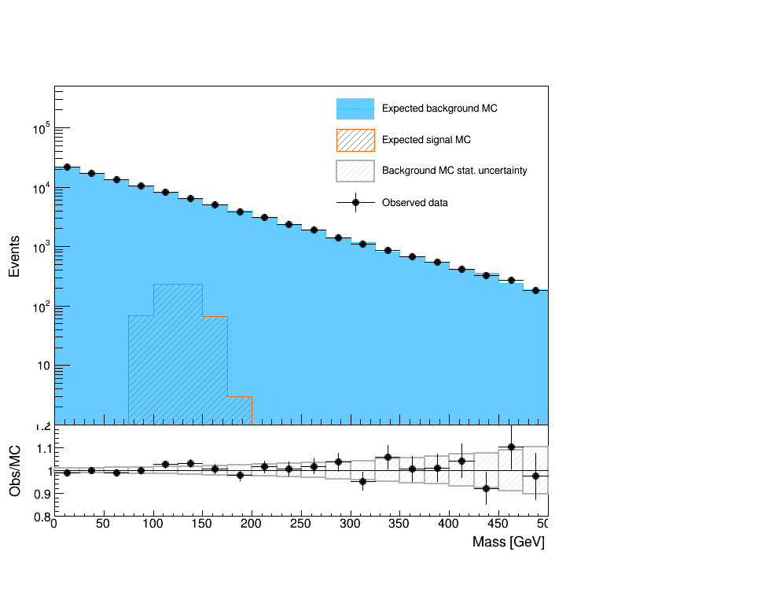
</p>

The background Monte Carlo is generated from an exponential distribution 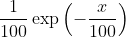. The signal template is generated from a Gaussian distribution with 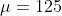 and 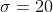. The (fake) observed data is obtained from the sum of signal and background templates with Gaussian noise of mean 0 and standard deviation equals to square root of the bin count.

The hypothesis test answers the following question: Is the observed data compatible with the null hypothesis 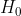 (background only) or the alternative hypothesis 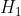 (signal+background). The Neyman-Pearson lemma states that the most powerful test statistics is the log likelihood ratio of the two hypotheses given the observed data:

<p align="center">
    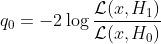
</p>


In binned histograms, 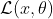 is the Poisson likelihood of the rate parameter  given the observed data 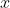. The test statistics for a binned histogram with Neyman-Pearson lemma thus becomes:

<p align="center">
    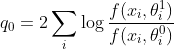,
</p>
where
<p align="center">
    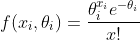,
</p>

is the Poisson likelihood and 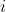 is the index of each bin. 

The goodness-of-fit test, on the other hand, only evalutes the compatibility of the observed data with the null hypothesis. Steve Baker and Bob Cousins ([Nucl. Instrum. Meth., 1984](https://www.sciencedirect.com/science/article/abs/pii/0167508784900164)) derived the following test statistics using saturated models for Poisson binned histograms:

<p align="center">
    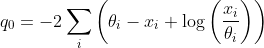
</p>
 
where the saturated model of the data is taken as the alternative hypothesis. This test statistics can be interpreted as the upper bound for the family of alternative hypothesis distributions.

In frequentist method, a distribution of the test statistics 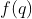 is generated numerically from Monte Carlo algorithm. Each toy data is generated randomly from a Poisson distribution of each bin in the null hypothesis, then evaluated against either the Neyman-Pearson log likehood ratio or the Goodness-of-fit formula to obtain the test statistics 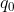. The observed data test statistics 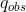 is obtained similarly from the provided input. The p-value is then computed as:

<p align="center">
    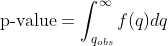
</p>

Generating the test statistics distribution is a computationally expensive task, especially in traditional scientific fields like particle physics, where a discovery requires a 5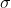 deviation from the distribution, corresponding to a p-value less than 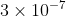. This package parallelizes the Monte Carlo generation step on GPU, providing a speedup of approximately 500 times when evaluated against a single CPU core.   

### 2. Algorithm Overview
TBD

### 3. GPU Optimization and Specifics
TBD

### 4. Code Structure
TBD

### 5. Execution Instructions

#### Dependencies
This package was developed and tested on Linux machines with CUDA version >= 9.1 and g++ version >= 4.8.5.

#### Installation
```
git clone git@github.com:thongonary/cuda-frequentist.git
cd cuda-frequentist
make
```

#### Neyman-Pearson hypothesis testing
The alternative hypothesis is explicitly required, ie, signal templated needs to be provided.

Usage: 
```
    ./neyman-pearson <number of bins> \
                     <background template file> \
                     <signal template file> \
                     <observed data file> \
                     <number of toys> \
                     [--out <output file> (optional)] \
                     [--GPUonly <0 or 1> (optional)] 
```

#### Improved chisquare goodness-of-fit testing
The saturated model is used as the alternative hypothesis, therefore no signal template is required.

Usage:
```
    ./goodness-of-fit <number of bins> \
                      <background template file> \
                      <observed data file> \
                      <number of toys> \
                      <output file> \
                     [--out <output file> (optional)] \
                     [--GPUonly <0 or 1> (optional)] 
```

#### Parameters:
<ul>
<li> <code>number of bins</code>: Number of bins used in the histograms for the test. The provided examples in <code>resources</code> directory use 20 bins. </li>
<li> <code>background template file</code>: A text file containing the count of each bin in the background template histogram. An example can be found in <code>resources/background_template.txt</code>. </li>
<li> <code>signal template file</code>: A text file containing the count of each bin in the signal template histogram. Only required for Neyman-Pearson hypothesis test. An example can be found in <code>resources/signal_template.txt</code>. </li>
<li> <code>observed data file</code>: A text file containing the count of each bin in the observed data histogram. An example can be found in <code>resources/observed_data.txt</code>. </li>
<li> <code>number of toys</code>: Number of toy Monte Carlo simulation to obtain the test statistics distribution. For a large number of toys (above 1e8), depending on the available device memory, the generation on GPU may be done by batches if the output is kept with the <code>--out</code> option. </li>
<li> <code>--out [string]</code> (optional): Destination to save the generated test statistics. Note that for a large number of toys (above 1e7), saving the output to disk may take a long time depending on the disk IO. The output name will be appended with <code>X.dev</code>, where <code>X</code> is the value of test statistics for the observed data and <code>dev</code> is either <code>cpu</code> or <code>gpu</code>, indicating whether the result is generated with CPU or GPU, respectively. If this option is not specified, the generated test statistics will not be kept and only the p-value will be computed.</li>
<li> <code>--GPUonly [integer]</code> (optional): Whether to run the generation only on GPU. </li>
</ul>

### 6. Demo Scripts and Outputs 

Neyman-Pearson test with 10M Monte Carlo toys, running on both CPU and GPU:
```
$ ./neyman-pearson 20 resources/background_template.txt resources/signal_template.txt resources/observed_data.txt 1e7

[INPUT] Reading 20 bins from background file resources/background_template.txt
[INPUT] Reading 20 bins from data file resources/observed_data.txt
[INPUT] Reading 20 bins from signal file resources/signal_template.txt

Generating 10000000 toy experiments to obtain the test statistics distribution on CPU
  ████████████████████████████████████████▏ 100.0% [10000000/10000000 | 62.5 kHz | 160s<0s]

Generating 10000000 toy experiments to obtain the test statistics distribution on GPU
[INFO] Free device memory: 11794/12209 MB
+  Using 9765 blocks with 1024 threads per block

Toy-generation run time:
+ On CPU: 160102 ms
+ On GPU: 287.618 ms
Gained a 557-time speedup with GPU

p-value from Neyman-Pearson hypothesis test: less than 1e-07 (CPU), less than 1e-07 (GPU).
Rerun with at least 250000000 toys to obtain a more statistically precise result.
```

Goodness of fit test with 1e7 Monte Carlo toys, running on both CPU and GPU:
```
$ ./goodness-of-fit 20 resources/background_template.txt resources/observed_data.txt 1e7 --out gof-test --GPUonly 0

[INPUT] Will save output to disk
[INPUT] Reading 20 bins from background file resources/background_template.txt
[INPUT] Reading 20 bins from data file resources/observed_data.txt

Generating 10000000 toy experiments to obtain the test statistics distribution on CPU
  ████████████████████████████████████████▏ 100.0% [10000000/10000000 | 70.5 kHz | 142s<0s]

Generating 10000000 toy experiments to obtain the test statistics distribution on GPU
[INFO] Free device memory: 11756/12209 MB
+  Using 9765 blocks with 1024 threads per block

Toy-generation run time:
+ On CPU: 141799 ms
+ On GPU: 306.239 ms
Gained a 463-time speedup with GPU

Saving the toy experiments' test statistics to gof-test.1681.881348.cpu and gof-test.1681.881348.gpu
  ████████████████████████████████████████▏ 100.0% [10000000/10000000 | 786.3 kHz | 13s<0s]

p-value from Goodness-of-fit test: 0.003873 (CPU), 0.0038474 (GPU)
```

Neyman-Pearson test with 2.5 billion Monte Carlo toys, running only on GPU and not writing the output to disk:
```
$ ./neyman-pearson 20 resources/background_template.txt resources/signal_template.txt resources/observed_data.txt 2.5e9 --GPUonly 1

[INPUT] Use GPU only
[INPUT] Reading 20 bins from background file resources/background_template.txt
[INPUT] Reading 20 bins from data file resources/observed_data.txt
[INPUT] Reading 20 bins from signal file resources/signal_template.txt

Generating 2500000000 toy experiments to obtain the test statistics distribution on GPU
[INFO] Free device memory: 11794/12209 MB
+  Using 239035 blocks with 1024 threads per block
Toy-generation run time on GPU: 67524.4 ms

p-value from Neyman-Pearson hypothesis test: 2.28e-08 (GPU)
```

Goodness of fit test with 400M Monte Carlo toys, running only on GPU and saving the output to disk. Note that the generation is done by batches and the writing of 400M floats to disk might take a few minutes:
```
$ ./goodness-of-fit 20 resources/background_template.txt resources/observed_data.txt 4e8 --out gof-test --GPUonly 1

[INPUT] Will save output to disk
[INPUT] Use GPU only
[INPUT] Reading 20 bins from background file resources/background_template.txt
[INPUT] Reading 20 bins from data file resources/observed_data.txt

Generating 400000000 toy experiments to obtain the test statistics distribution on GPU
Generating in 2 batches
+ Batch 1 of 2: Generating 309182464 toys
	-- Using 215128 blocks with 1024 threads per block
+ Batch 2 of 2: Generating 90817536 toys
	-- Using 88689 blocks with 1024 threads per block
Toy-generation run time on GPU: 11389.7 ms
Saving the toy experiments' test statistics to gof-test.1681.881348.gpu
  ████████████████████████████████████████▏ 100.0% [400000000/400000000 | 1.8 MHz | 227s<0s]

p-value from Goodness-of-fit test: 0.00384817 (GPU)
```
