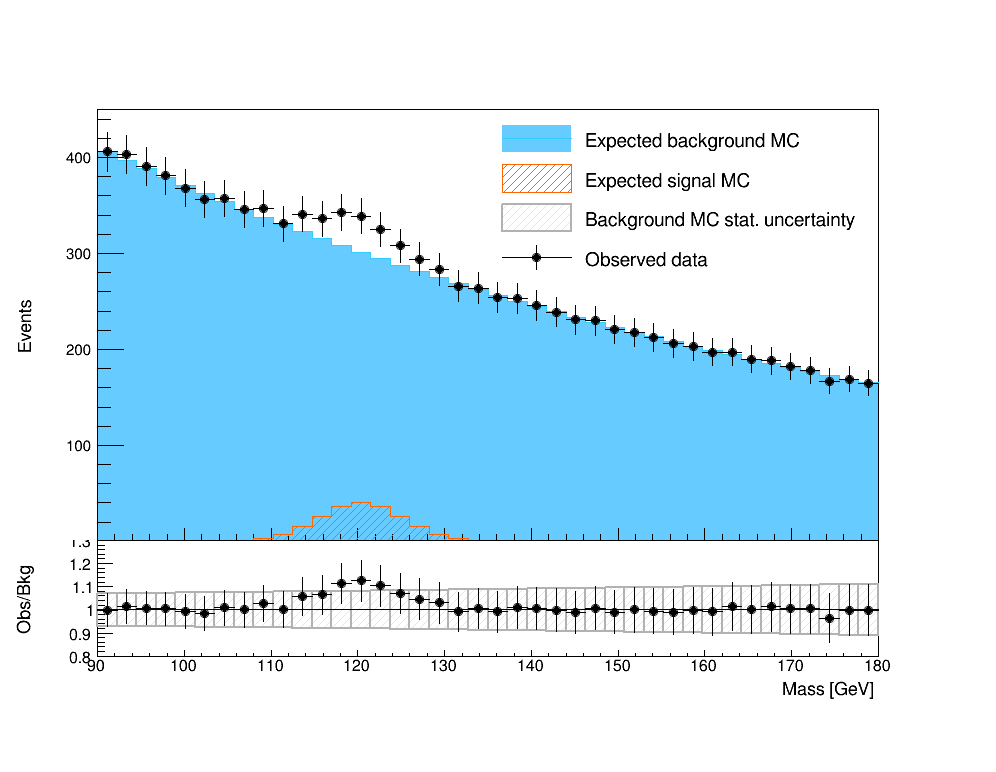
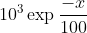
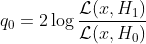
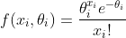

## GPU-Accelerated Toy Monte-Carlo Generator for Frequentist Simple Hypothesis Testing

Author: Thong Q. Nguyen, who got bored, decided to learn GPU programming and wrote this for fun. 

### Table of Contents

* [1. Introduction](#1-introduction)
* [2. Algorithm Overview](#2-algorithm-overview)
* [3. GPU Optimization and Specifics](#3-gpu-optimization-and-specifics)
    * [Random number dependency](#random-number-dependency)
    * [Memory overflow](#memory-overflow)
    * [Coalesced memory access](#coalesced-memory-access)
    * [Data transfer between host and device](#data-transfer-between-host-and-device)
* [4. Code Structure](#4-code-structure)
* [5. Execution Instructions](#5-execution-instructions)
    * [Dependencies](#dependencies)
    * [Installation](#installation)
    * [Neyman-Pearson hypothesis testing](#neyman-pearson-hypothesis-testing)
    * [Improved chisquare goodness-of-fit testing](#improved-chisquare-goodness-of-fit-testing)
    * [Parameters:](#parameters)
* [6. Demo Scripts and Outputs](#6-demo-scripts-and-outputs)
* [7. Result Validation](#7-result-validation)


### 1. Introduction
This package parallelizes the Monte Carlo simulation of the test statistics used in frequentist hypothesis testing for binned histograms using CUDA. Two algorithms are implemented: Simple hypothesis test using Neyman-Pearson lemma and Improved chisquare goodness-of-fit test using saturated model from observed data. An example from [resources](resources) directory provides the bin contents of the following histogram:
<p align="center">
    
</p>

The background Monte Carlo is generated from an exponential distribution . The signal template is generated from a Gaussian distribution . The (fake) observed data is obtained from the sum of signal and background templates with Gaussian noise of mean 0 and standard deviation proportional to square root of the bin count.

The hypothesis test answers the following question: Is the observed data compatible with the null hypothesis  (background only) or the alternative hypothesis  (signal+background). The Neyman-Pearson lemma states that the most powerful test statistics is the log likelihood ratio of the two hypotheses given the observed data:

<p align="center">
    
</p>


In binned histograms,  is the Poisson likelihood of the rate parameter  given the observed data . The test statistics for a binned histogram with Neyman-Pearson lemma thus becomes:

<p align="center">
    ,
</p>
where
<p align="center">
    ,
</p>

is the Poisson likelihood and  is the index of each bin. 

The goodness-of-fit test, on the other hand, only evalutes the compatibility of the observed data with the null hypothesis. Steve Baker and Bob Cousins ([Nucl. Instrum. Meth., 1984](https://www.sciencedirect.com/science/article/abs/pii/0167508784900164)) derived the following test statistics using saturated models for Poisson binned histograms:

<p align="center">
    
</p>
 
where the saturated model of the data is taken as the alternative hypothesis. This test statistics can be interpreted as the upper bound for the family of alternative hypothesis distributions.

In frequentist method, a distribution of the test statistics  is generated numerically from Monte Carlo algorithm. Each toy data is generated randomly from a Poisson distribution of each bin in the null hypothesis, then evaluated against either the Neyman-Pearson log likehood ratio or the Goodness-of-fit formula to obtain the test statistics . The observed data test statistics  is obtained similarly from the provided input. The p-value is then computed as:

<p align="center">
    
</p>

Generating the test statistics distribution is a computationally expensive task, especially in traditional scientific fields like particle physics, where a discovery requires a 5 deviation from the distribution, corresponding to a p-value less than . This package parallelizes the Monte Carlo generation step on GPU and when running on an NVIDIA GeForce TITAN X against an Intel core 3.0 GHz, provides a speedup of over 400 times.

### 2. Algorithm Overview
On CPU:
<ul>
<li> Compute the observed test statistics </li>
<li> Loop through the number of toys needed to be generated</li>
<li> For each loop, generated toy dataset following Poisson distributions with respect to the background templates . Compute the test statistics  using either Neyman-Pearson or goodness-of-fit test statistics formula.</li>
<li> If  > , increase the global counter.</li>
<li> Obtain the pvalue by dividing the global counter by the number of toys.</li>
</ul>

On GPU, the loop is replaced with CUDA threads. On each thread, a random seed is initialized based on device clock and the global thread index. `atomicAdd` is performed on the global counter to guarantee no collision between different threads.

### 3. GPU Optimization and Specifics
#### Random number dependency
In typical random number generator, the numbers are generated sequentially to guarantee truely random values, causing a dependency problem that is hard to parallelize. In this package, each thread is assigned 1 unique random state and generates only 1 toy, where the random state is initialized based on the device clock and a unique global thread index. Maximum number of threads is used, constrained by number of blocks per grid and the available device memory to allocate 1 unique random states to each thread. When number of toys is greater than number of threads, after the first launch, the global index of each thread is updated and the random state stored in each thread is initialized again, with the new global thread index and clock value, guaranteeing a new unique random toy. 

#### Memory overflow
If the list of test statistics is kept, it needs to allocate a memory space equals to `nToys x sizeof(float)`. If an enormouse amount of toys needs to be generated (more than 100 million), it's not possible to store the whole list in the device memory. A check on the available memory is performed and will be used to split the generation process by batches if necessary. After each batch, the array of test statistics on device is copied to the host memory, freed, and reallocated for the new batch. This process guarantees no memory overflow. 

Another big memory consumption of the program is the array of random states, where each `curandState` takes 40 bytes. Number of random states is set to be `nBlocks x threadsPerBlock`, where `nBlocks` are optimized based on available device memory so that the array of random states never takes more than 95% available memory of the device.

#### Coalesced memory access
The global memory contains an array of the random state and an array of the test statistics distribution. The accesses to both of these arrays are coalesced, where adjacent threads access adjacent indices of the arrays. Number of blocks is set to be multiples of warp size to avoid misaligned access pattern by warps. 

#### Data transfer between host and device
As the bandwidth between host and device memory is typically limited, this program minimizes the data transfer between host and device. The input and output are only transferred once throughout the program, with the exception of generation by batches, where the output is transferred back to host after each batch while the input stays in device memory and only gets deleted at the end.

### 4. Code Structure
The main program is located at [src/toygenerator.cpp](src/toygenerator.cpp), where it calls CUDA kernels at [src/toygenerator.cu](src/toygenerator.cu). The flag `GOF` is specified during compilation (see [Makefile](Makefile)) to determine whether to run goodness-of-fit test or Neyman-Pearson test.

### 5. Execution Instructions

#### Dependencies
This package was developed and tested on Linux machines with CUDA version >= 9.1 and g++ version >= 4.8.5.

#### Installation
```
git clone git@github.com:thongonary/cuda-frequentist.git
cd cuda-frequentist
make
```

#### Neyman-Pearson hypothesis testing
The alternative hypothesis is explicitly required, ie, signal templated needs to be provided.

Usage: 
```
    ./neyman-pearson <number of bins> \
                     <background template file> \
                     <signal template file> \
                     <observed data file> \
                     <number of toys> \
                     [--out <output file> (optional)] \
                     [--GPUonly <0 or 1> (optional)] 
```

#### Improved chisquare goodness-of-fit testing
The saturated model is used as the alternative hypothesis, therefore no signal template is required.

Usage:
```
    ./goodness-of-fit <number of bins> \
                      <background template file> \
                      <observed data file> \
                      <number of toys> \
                      <output file> \
                     [--out <output file> (optional)] \
                     [--GPUonly <0 or 1> (optional)] 
```

#### Parameters:
<ul>
<li> <code>number of bins</code>: Number of bins used in the histograms for the test. The provided examples in <a href="resources"> resources directory </a> use 40 bins. </li>
<li> <code>background template file</code>: A text file containing the count of each bin in the background template histogram. An example can be found in <a href="resources/background_template.txt">resources/background_template.txt</a>. </li>
<li> <code>signal template file</code>: A text file containing the count of each bin in the signal template histogram. Only required for Neyman-Pearson hypothesis test. An example can be found in <a href="resources/signal_template.txt">resources/signal_template.txt</a>. </li>
<li> <code>observed data file</code>: A text file containing the count of each bin in the observed data histogram. An example can be found in <a href="resources/observed_data.txt">resources/observed_data.txt</a>. </li>
<li> <code>number of toys</code>: Number of toy Monte Carlo simulation to obtain the test statistics distribution. For a large number of toys (above 1e8), depending on the available device memory, the generation on GPU may be done by batches if the output is kept with the <code>--out</code> option. </li>
<li> <code>--out [string]</code> (optional): Destination to save the generated test statistics. Note that for a large number of toys (above 1e7), saving the output to disk may take a long time depending on the disk IO. The output name will be appended with <code>X.dev</code>, where <code>X</code> is the value of test statistics for the observed data and <code>dev</code> is either <code>cpu</code> or <code>gpu</code>, indicating whether the result is generated with CPU or GPU, respectively. If this option is not specified, the generated test statistics will not be kept and only the p-value will be computed.</li>
<li> <code>--GPUonly [integer]</code> (optional): Whether to run the generation only on GPU. </li>
</ul>

### 6. Demo Scripts and Outputs 

Neyman-Pearson test with 10M Monte Carlo toys, running on both CPU and GPU:
```
$ ./neyman-pearson 40 resources/background_template.txt resources/signal_template.txt resources/observed_data.txt 1e7

[INPUT] Reading 40 bins from background file resources/background_template.txt
[INPUT] Reading 40 bins from data file resources/observed_data.txt
[INPUT] Reading 40 bins from signal file resources/signal_template.txt

Generating 10000000 toy experiments to obtain the test statistics distribution on CPU
  ████████████████████████████████████████▏ 100.0% [10000000/10000000 | 29.3 kHz | 342s<0s]

Generating 10000000 toy experiments to obtain the test statistics distribution on GPU
[INFO] Free device memory: 12100/12212 MB
+  Using 9760 blocks with 1024 threads per block

Toy-generation run time:
+ On CPU: 341646 ms
+ On GPU: 702.995 ms
Gained a 486-time speedup with GPU

p-value from Neyman-Pearson hypothesis test: 9.6e-06 (CPU), 1.11e-05 (GPU)
```

Goodness of fit test with 1e7 Monte Carlo toys, running on both CPU and GPU:
```
$  ./goodness-of-fit 40 resources/background_template.txt resources/observed_data.txt 1e7 --out gof-test --GPUonly 0

[INPUT] Will save output to disk
[INPUT] Reading 40 bins from background file resources/background_template.txt
[INPUT] Reading 40 bins from data file resources/observed_data.txt

Generating 10000000 toy experiments to obtain the test statistics distribution on CPU
  ████████████████████████████████████████▏ 100.0% [10000000/10000000 | 33.1 kHz | 302s<0s]

Generating 10000000 toy experiments to obtain the test statistics distribution on GPU
[INFO] Free device memory: 12062/12212 MB
+  Using 9760 blocks with 1024 threads per block

Toy-generation run time:
+ On CPU: 302376 ms
+ On GPU: 712.78 ms
Gained a 424-time speedup with GPU

Saving the toy experiments' test statistics to gof-test.387.840790.cpu and gof-test.387.840790.gpu
  ████████████████████████████████████████▏ 100.0% [10000000/10000000 | 771.6 kHz | 13s<0s]

p-value from Goodness-of-fit test: 0.0304102 (CPU), 0.030267 (GPU)
```

Neyman-Pearson test with 2.5 billion Monte Carlo toys, running only on GPU and not writing the output to disk:
```
$ ./neyman-pearson 40 resources/background_template.txt resources/signal_template.txt resources/observed_data.txt 2.5e9 --GPUonly 1

[INPUT] Use GPU only
[INPUT] Reading 40 bins from background file resources/background_template.txt
[INPUT] Reading 40 bins from data file resources/observed_data.txt
[INPUT] Reading 40 bins from signal file resources/signal_template.txt

Generating 2500000000 toy experiments to obtain the test statistics distribution on GPU
[INFO] Free device memory: 11794/12209 MB
+  Using 239040 blocks with 1024 threads per block
Toy-generation run time on GPU: 180124 ms

p-value from Neyman-Pearson hypothesis test: 1.07404e-05 (GPU)
```

Goodness of fit test with 400M Monte Carlo toys, running only on GPU and saving the output to disk. Note that the generation is done by batches and the writing of 400M floats to disk might take a few minutes:
```
$ ./goodness-of-fit 40 resources/background_template.txt resources/observed_data.txt 4e8 --out gof-test --GPUonly 1

[INPUT] Will save output to disk
[INPUT] Use GPU only
[INPUT] Reading 40 bins from background file resources/background_template.txt
[INPUT] Reading 40 bins from data file resources/observed_data.txt

Generating 400000000 toy experiments to obtain the test statistics distribution on GPU
Generating in 2 batches
+ Batch 1 of 2: Generating 309192295 toys
	-- Using 215104 blocks with 1024 threads per block
+ Batch 2 of 2: Generating 90807705 toys
	-- Using 88672 blocks with 1024 threads per block
Toy-generation run time on GPU: 29031.9 ms
Saving the toy experiments' test statistics to gof-test.387.840790.gpu
  ████████████████████████████████████████▏ 100.0% [400000000/400000000 | 1.6 MHz | 245s<0s]

p-value from Goodness-of-fit test: 0.0302518 (GPU)
```

### 7. Result Validation

The test statistics distributions generated by GPU and CPU are nearly identical in both Neyman-Pearson and goodness-of-fit algorithms, indicating that the CUDA implementation is correct and can replicate the results using CPU. As expected, the p-value obtained from Neyman-Pearson lemma is much smaller than goodness-of-fit test, since the Neyman-Pearson lemma is the most powerful test statistics and the observed data is obtained from the the alternative hypothesis. This Neyman-Pearson p-value of 1e-5 corresponds to a Z score of 4.3, close to a discovery by traditional conventions (but not there yet!).  


